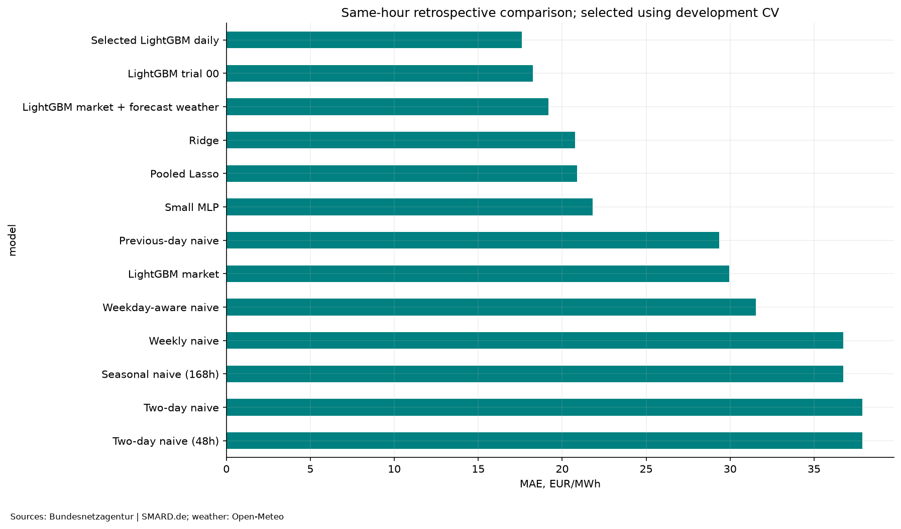
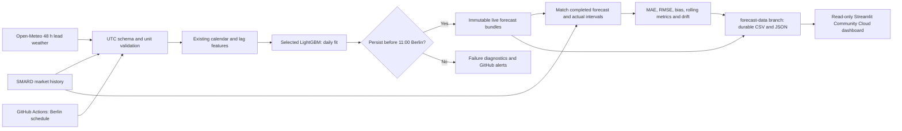

# German Day-Ahead Electricity Price Forecasting

Forecast the 24 hourly day-ahead prices of the German–Luxembourg (DE-LU) bidding zone using only
information available before the 11:00 (Europe/Berlin) cutoff on the day before delivery.



## Results (retrospective, 8,760 hours: 2025-09-25 → 2026-09-24)

**Benchmark provenance:** the numbers below predate the production DST correction.
On the last hour of a 25-hour autumn day, the old 24-hour price lag could use a
delivery-day price. Production now uses 25 hours for that one interval. These
preserved results must be recomputed before claiming corrected-model accuracy.

Rolling-origin evaluation: for each delivery day the model is trained only on earlier days
(2-year window) and refit weekly (the selected model daily). Tuning used four development folds
that all precede the test year.

| Model | MAE (EUR/MWh) | RMSE (EUR/MWh) |
|---|---:|---:|
| Seasonal naive (168 h) | 36.74 | 56.57 |
| Previous-day naive (24 h) | 29.34 | 46.90 |
| LightGBM, market features only | 29.96 | 44.83 |
| LightGBM, market + 48 h-lead weather forecasts | 19.19 | 32.07 |
| LightGBM, tuned, daily refit (**selected on development CV**) | **17.58** | **30.32** |

* The selected model's MAE is 19.15 EUR/MWh lower than the weekly baseline (95 % weekly-block bootstrap CI 16.3–22.4).
* Nominal 80 % quantile intervals cover only **62 %** of hours: they are **not calibrated**.
* The test year had already been inspected before the final selection, so it is a retrospective benchmark,
  not a fresh holdout, and not evidence of live trading performance. Weather publication times and market
  revisions are not reconstructed (a conservative 48 h lead is assumed).

## Quick start

```bash
python -m venv .venv && source .venv/bin/activate      # Windows: .venv\Scripts\activate
pip install -e ".[dev]"
pytest                                                  # offline tests, no data needed

# download inputs into data/raw (SMARD ~10 min; Open-Meteo)
python scripts/download_smard.py --start 2019-01-01 --out data/raw/smard.parquet
python scripts/download_weather.py --source forecast --start 2024-04-01 --out data/raw/weather_forecast.parquet
python scripts/download_weather.py --source archive  --start 2019-01-01 --out data/raw/weather_archive.parquet

depower run --quick      # ~2 min smoke run (one test week)
depower run              # full experiment, ~30 min; writes data/processed/pipeline/
```

`depower run` options: `--root`, `--out`, `--skip-extended`, `--skip-intervals`, `--trials N`.
Set `DEPOWER_SMOKE=1` to include the end-to-end smoke test in `pytest`.

## Repository layout

```
src/depower/
  config.py       constants, test window, default LightGBM parameters
  data.py         loading, SHA-256 manifest, data-quality audit
  features.py     leakage-safe calendar / lag / weather features, naive baselines
  backtest.py     rolling-origin backtests (plain and with per-fit diagnostics)
  metrics.py      MAE/RMSE/bias, block bootstrap, error slices, interval scores
  models.py       LightGBM, Ridge, Lasso, MLP factories and the bounded search space
  selection.py    chronological CV, hyperparameter search, learning/capacity curves
  intervals.py    q10/q90 LightGBM intervals
  covariates.py   as-of selection of revisioned covariates
  live.py         forward-validation workflow (11:00 cutoff, immutable forecast records)
  plots.py        all figures
  pipeline.py     orchestration of the whole experiment;  cli.py  `depower` command
scripts/          data downloaders, notebook executor
tests/            offline tests (leakage, DST, backtest, metrics, live, CLI)
notebooks/        analysis.ipynb, end_to_end_forecast.ipynb (self-contained teaching walkthrough)
docs/             ROADMAP.md (original plan), project_overview.html, figures/
```

`notebooks/end_to_end_forecast.ipynb` is the self-contained walkthrough; the `depower` package is
the reusable version of the same code. Running `depower run` reproduces the notebook's result
tables exactly in the original version (verified then: differences of 0.0 in all
model MAE/RMSE, CV scores and interval summary). The production DST correction
requires rerunning affected dates; original notebook outputs are preserved.

## Data and methodology

| Source | What | Access |
|---|---|---|
| [SMARD](https://www.smard.de) (Bundesnetzagentur) | DE-LU day-ahead price, load, residual load, solar, wind; hourly | public API, CC BY 4.0 |
| [Open-Meteo Previous Runs API](https://open-meteo.com/en/docs/previous-runs-api) | ECMWF IFS 48 h-lead forecasts (temperature, 100 m wind, radiation, cloud cover) at 5 sites | free, non-commercial |
| [Open-Meteo Archive](https://open-meteo.com/en/docs/historical-weather-api) | Retrospective weather, used for EDA only | free, non-commercial |

* **No leakage:** price/load lags are ≥ 48 h (plus a 24 h *price* lag, since D-1 prices are public); rolling
  statistics end 48 h before delivery; only forecast (never observed) weather enters models.
* **Time:** everything is UTC; Berlin time is used for calendar features, delivery days and DST (23/25 h days).
* **Negative prices and spikes are kept**; no percentage errors are used.
* Since 1 Oct 2025 the market has 15-minute products; the target is SMARD's hourly representation.

Cite SMARD as "Bundesnetzagentur | SMARD.de".

## Limitations

Five weather points are coarse regional proxies; load/renewable forecasts, outages, fuel and carbon
prices are not integrated (`depower.covariates` provides the as-of selection helper for them). The live
workflow is now wrapped by `depower.production`. Source ingestion and local app
startup are verified; no genuine live forecast, remote CI or public deployment is claimed.

## Production application

The application reuses the selected LightGBM model, hourly next-day horizon,
730-day training window and daily refitting. A replay artifact is never used as a
current live model. UTC target timestamps and Berlin issue cutoffs remain distinct.



Five views cover forecast overview, predicted vs actual, model performance,
data/model monitoring and architecture. Empty and stale data are visible statuses;
historical experiments are kept separate from live evidence. No MAPE or price clipping.

```bash
pip install -r requirements-dev.txt  # deployment environment: Python 3.12
python -m depower.production seed --state data/state  # once, with downloaded raw inputs
python -m depower.production forecast --state data/state --runtime data/runtime-first
python -m depower.production monitor --state data/state --runtime data/runtime-next
streamlit run app.py
```

Forecasts must run before **11:00 Europe/Berlin**; each invocation requires a new
empty runtime directory. The scheduled workflow runs at **09:17 and 10:17 Berlin**
(idempotent retry), with **18:17** monitoring. GitHub scheduling is best-effort;
late forecasts are withheld. Automatic work: capture, validation, daily fitting,
immutable issue, matching, metrics, alerts and state commits. Manual work: initial
data-branch setup, account authentication, approved publishing, notifications,
candidate configuration promotion and periodic storage review.

Runtime captures and fitted artifacts are retained for seven days by Actions;
CSV histories and small forecast bundles persist independently on `forecast-data`.
The dashboard reads its JSON export after restarts and never trains or loads a
remote pickle. Required live inputs fail closed; cloud gaps use native LightGBM
handling. Historical revision/publication limitations remain documented.

Meaningful additions: `app.py`, `depower.production`, `depower.monitoring`,
`depower.validation`, frozen selection/weather metadata in `production/`, controlled
requirements, forecast workflow, Streamlit theme and production regression tests.

- [Assessment and implementation decisions](docs/assessment.md)
- [Exact local, GitHub and Streamlit deployment steps](docs/deployment.md)
- [Retraining acceptance, promotion and rollback](docs/retraining.md)
- [Verification and deployment status](docs/verification.md)

**Deployment status:** code pushed to `main` and persistent `forecast-data` branch
created on 2026-10-09 with owner approval. GitHub CI passed on Linux; the remote
monitor refreshed and persisted observations, with the expected no-live-forecast
alert. Streamlit GitHub sign-in is complete and deployment awaits the owner's
form submission. No public application URL is verified yet.
Target recurring cost is **€0** for modest non-commercial use with a public
repository's standard runners, Streamlit Community Cloud and Open-Meteo's free
API. Quotas, no-SLA operation and annual storage maintenance are discussed in
the runbook. Private-repository runner quotas must be checked before publishing.
